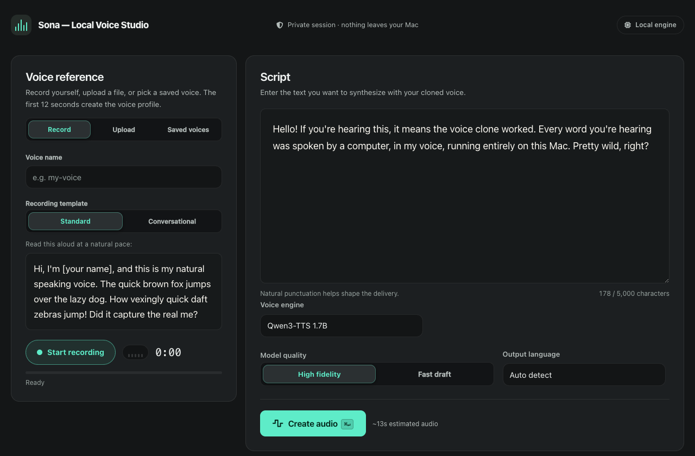

# Local Voice Cloning

Clone a voice locally on your Mac using Apple MLX. Audio never leaves your computer.

Provide a short audio sample and text, and the app generates speech as a WAV or MP3 file.



## Requirements

- Apple Silicon Mac (M-series)
- Python 3.10+
- ~8 GB free disk space (models download automatically on first run)

## Setup

```bash
uv sync
```

For development:

```bash
uv sync --extra dev
```

## Web App

Start the app:

```bash
uv run shiny run app.py
```

Open the URL shown in your terminal (e.g. `http://127.0.0.1:<port>`), then:
1. Record or upload a 5–12 second voice clip, or select / import a saved voice.
2. Check the automatic transcript and fix any mistakes.
3. Enter your script and click **Create audio**.

## CLI

```bash
uv run python -m src.cli \
  --reference voice_sample.wav \
  --text "Hello world" \
  --output output.wav
```

Options:
- `--quality`: `high` (default) or `fast`
- `--language`: Target language (`auto` by default)
- `--engine`: `qwen` (default) or `omnivoice`
- `--ref-text`: Transcript of reference audio (transcribed automatically if omitted)

## REST API

Start the API:

```bash
uv run uvicorn src.api:app --port 8001
```

Open `http://127.0.0.1:8001/docs` for API docs, or generate speech via curl:

```bash
curl -X POST http://127.0.0.1:8001/synthesize \
  -F "reference_audio=@voice_sample.wav" \
  -F "text=Hello from the API" \
  -o output.wav
```

## Optional: OmniVoice (600+ Languages)

To add voice cloning in 600+ languages:

```bash
uv sync --extra omnivoice
uv run --extra omnivoice shiny run app.py
```

Select **OmniVoice** under **Voice engine** in the app, or pass `--engine omnivoice` to the CLI or API.

## Tips for Best Results

- Use 5–12 seconds of clear, natural speech.
- Record in a quiet room with a single speaker.
- Check and correct the reference transcript before generating.
- Use punctuation (commas, periods) to control pauses and pacing.

## Testing

```bash
uv run pytest
```
